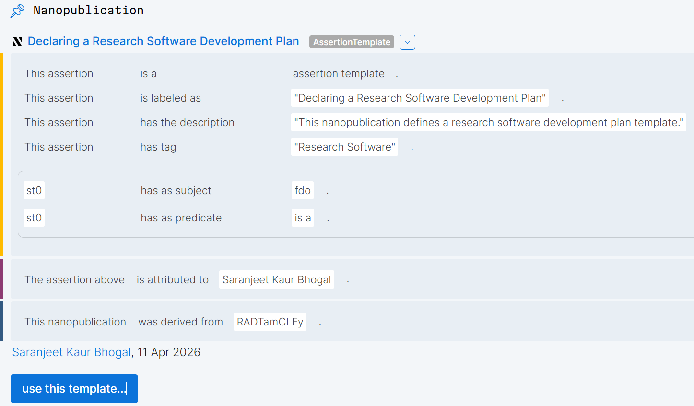

## What is research software

Research software is software that is created specifically as part of the research process or to support a research purpose. According to the FAIR for Research Software report on "[Defining Research Software: a controversial discussion](https://zenodo.org/records/5504016)", _Research Software includes source code files, algorithms, scripts, computational workflows and executables that were created during the research process or for a research purpose. Software components (e.g., operating systems, libraries, dependencies, packages, scripts, etc.) that are used for research but were not created during or with a clear research intent should be considered software in research and not Research Software. This differentiation may vary between disciplines. The minimal requirement for achieving computational reproducibility is that all the computational components (Research Software, software used in research, documentation and hardware) used during the research are identified, described, and made accessible to the extent that is possible._

Research software can take many different forms. It may be a small script written to analyse a dataset, a collection of code used to run simulations, an R or Python package developed for a particular research project, or a large computational system used by a research community.

## Why the need for research software plans

When planning a research software project, it is useful to have a research software management and development plan to help define how the software will be developed, maintained, and sustained throughout its lifecycle. Such a plan can help researchers clarify their goals, identify resources and responsibilities, and make informed decisions about software development practices.

It can also provide a structured way to consider important aspects such as documentation, version control, testing, collaboration, reproducibility, sustainability, and long-term maintenance.

## Creating a research software management plan

## Declaring a research software development plan

The research software development plan can be declared using nanopublications, often referred to as nanopubs. Nanopubs are small, structured knowledge containers designed to communicate individual pieces of information in a clear and machine-readable way.

Each nanopublication typically consists of three main parts: an assertion, provenance information, and publication information. The assertion contains the main piece of knowledge being declared. Provenance provides information about where the assertion came from, how it was created, or the evidence supporting it. Publication information records details about the nanopublication itself, such as who created or published it and when.

Using nanopubs to declare a research software development plan makes it possible to break the plan down into smaller, reusable, and structured pieces of information. For example, individual nanopubs could declare the purpose of the software, its intended users, development practices, testing strategy, documentation requirements, dependencies, or plans for long-term maintenance.

This approach can make research software plans easier to share, reuse, update, and connect with other research outputs. It also allows different parts of a software development plan to be independently referenced while maintaining information about their origin and authorship. 

## References

- [Nanopubs 101](https://saranjeetkaur.github.io/nanopub_101/#/title-slide)
- [NL eScience Centre's software management plans](https://www.esciencecenter.nl/national-guidelines-for-software-management-plans/)
- Reusable template for [declaring a research software development plan](https://nanodash.knowledgepixels.com/explore?8&id=https://w3id.org/np/RAHTVJAieimxE4zUFYeSHu7cbgUUkbsmZ6Vba4dkJoQ2Q&label=Declaring+a+Research+Software+Development+Plan&context=https://orcid.org/0000-0002-7038-1457)